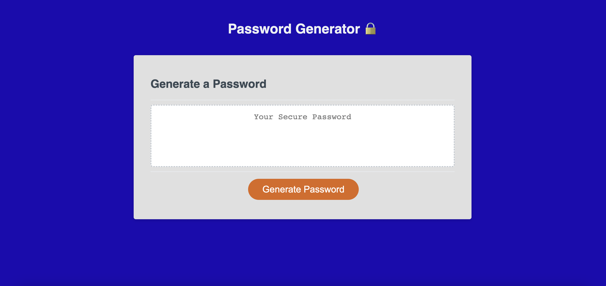

# Password Generator 🔒

## Description
The purpose of this project is to create a random password generator based on given user inputs to meet certain criteria. The language of focus for this project is JavaScript.

## Requirements
- Ensure a series of prompts are presented to user when 'Generate Password' button selected
- Ensure user is prompted for password criteria
- Ensure password length is at least 8 and no more than 128 characters
- Ensure user can confirm character types from lowercase, uppercase, special characters and/or numeric
- Ensure user confirms at least 1 character type
- Ensure generated password matches selected criteria
- Ensure generated password is displayed on page or written to alert

## Webpage Preview

## Link to Deployed Application
[Deployed Webpage](https://ajaycshan.github.io/password-generator/)